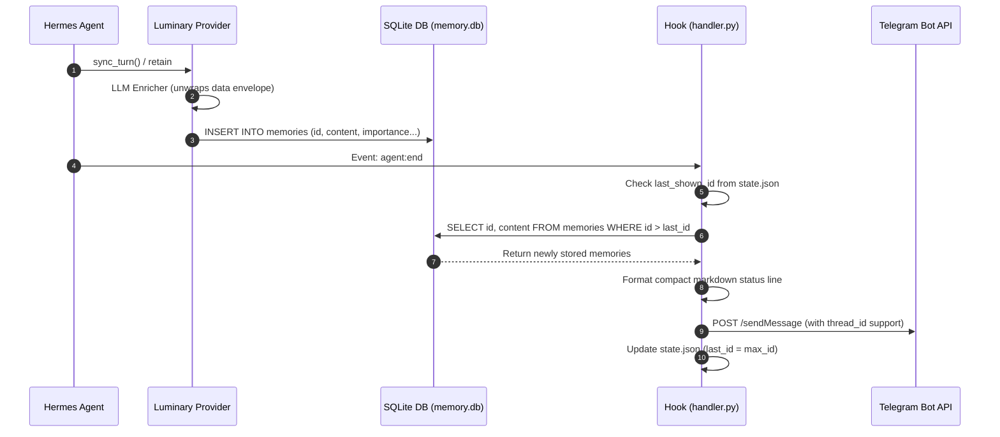

# v0.2.17 Debugging & Hermes Integration Guide

Comprehensive technical documentation for **Luminary Memory v0.2.17**, focusing on gateway envelope unwrapping, Hermes agent integration, Telegram activity hook mechanics, and 4-strategy fused recall verification.

---

## 1. Overview & Root Cause Analysis

### 1.1 The Cline Gateway / Proxy Envelope Issue
When using **LLM memory curation** (`ingest_llm = true`), `OpenAICompatibleEnricher` sends user/assistant conversation turns to an LLM endpoint to extract a concise factual summary, entities, tags, and importance scores.

Certain third-party API gateways and reverse proxies (e.g. **Cline Pass Gateway** `api.cline.bot` or aggregator proxies) wrap standard OpenAI ChatCompletion response bodies inside a top-level `"data"` key:

```json
{
  "data": {
    "id": "chatcmpl-...",
    "object": "chat.completion",
    "created": 1724000000,
    "model": "deepseek-v4-flash",
    "choices": [
      {
        "index": 0,
        "message": {
          "role": "assistant",
          "content": "{\"worth_saving\": true, \"summary\": \"User deployed Next.js portfolio to dwikycandra.vercel.app\", \"entities\": [\"Next.js\", \"dwikycandra.vercel.app\"], \"tags\": [\"project\", \"deploy\"]}"
        },
        "finish_reason": "stop"
      }
    ],
    "usage": { "prompt_tokens": 120, "completion_tokens": 45, "total_tokens": 165 }
  }
}
```

#### Why it failed silently in earlier versions:
1. `_call_llm()` executed `payload.get("choices")` directly on the root payload.
2. In wrapped responses, `payload.get("choices")` returned `None` (empty list `[]`).
3. `_call_llm()` returned an empty string `""`.
4. `enrich()` parsed `{}` $\rightarrow$ `summary = None`.
5. Provider retain pipeline logged:
   `retain skipped (LLM: no curated summary)`
6. **Result:** No new records were inserted into the SQLite database.

#### The Fix in v0.2.17:
In `src/luminary_memory/ingest/llm.py`:
```python
if isinstance(payload, dict) and isinstance(payload.get("data"), dict):
    payload = payload["data"]
```
This safely unwraps the payload when `"data"` is a dictionary, while maintaining 100% backward compatibility for direct endpoints (OpenAI, Ollama, Groq, OpenRouter).

---

## 2. Hermes Activity Hook Architecture (`luminary-activity`)

The `luminary-activity` hook is an event-driven plugin for the Hermes agent located at `~/.hermes/hooks/luminary-activity/`.

### 2.1 Hook Execution Flow



### 2.2 Why Telegram Notifications Were Previously Silent
The hook appeared to not fire because of the combination of two factors:
1. **Empty DB Inserts:** Due to the gateway envelope bug, memories were never stored $\rightarrow$ `_recent_activity()` returned `None` $\rightarrow$ no message was posted.
2. **Subprocess Environment Isolation:** If Hermes subprocess didn't pass `TELEGRAM_BOT_TOKEN` or `CHAT_ID` via `os.environ`, the hook previously exited early.

### 2.3 Hook Enhancements in v0.2.17
* **Self-Recovery Environment Loader:** If `os.getenv` is empty, `handler.py` automatically parses `~/.hermes/.env` to retrieve `TELEGRAM_BOT_TOKEN`, `TELEGRAM_HOME_CHANNEL`, `LUMINARY_HOOK_CHAT_ID`, and `TELEGRAM_HOME_CHANNEL_THREAD_ID`.
* **Thread / Topic ID Support:** If the target Telegram group uses Forum Topics (`TELEGRAM_HOME_CHANNEL_THREAD_ID`), messages are routed directly to the designated topic thread.
* **Safe State Persistence:** Atomically tracks `state.json` to prevent spamming duplicate notifications across multiple turns.

---

## 3. Recall Pipeline & Multi-Tier Context Memory

Luminary Memory organizes agent memory into three distinct tiers per conversation turn:

| Tier | Source | Injection Target | Lifetime / Behavior |
|------|--------|------------------|---------------------|
| **1. Core Memory** | Records tagged `core` in DB | System Prompt (`system_prompt_block`) | Auto-loaded **every session**, highest priority. Replaces `MEMORY.md`. |
| **2. Persistent Context** | Top memories by importance ($\ge$ threshold) | System Prompt (`system_prompt_block`) | Always present in context window, updated turn-by-turn with adaptive importance. |
| **3. Fused Recall** | 4-strategy fusion (Vector + BM25 + Temporal + Graph) | Turn Context (`prefetch` / `recall`) | Surfaced dynamically based on semantic and keyword relevance to the user's turn prompt. |

### 3.1 Content-Level Anti-Duplication
To preserve context tokens and prevent model confusion:
1. `system_prompt_block()` collects IDs and SHA-256/hash of all injected Core and Persistent memories.
2. When `prefetch()` or `recall()` runs, any memory matching an already-injected ID or identical text is **automatically suppressed**.
3. Every memory appears **exactly once** per prompt.

---

## 4. End-to-End Hermes Verification

### 4.1 Running the Verification Suite
To verify the full integration under Hermes runtime constraints:

```bash
# 1. Run all unit & regression tests
pytest -v

# 2. Run activity hook test suite
pytest tests/hermes/test_activity_hook.py

# 3. Check code style & linter
ruff check .
```

### 4.2 Simulation Test Script
You can simulate a complete agent session with local SQLite storage:

```python
import tempfile
from luminary_memory.hermes.provider import LuminaryMemoryProvider

with tempfile.TemporaryDirectory() as tmpdir:
    provider = LuminaryMemoryProvider()
    provider.initialize(
        session_id="session-001",
        hermes_home=tmpdir,
        platform="telegram"
    )
    
    # 1. Ingest Core & Rule memories
    client = provider._client
    client.ingest("User prefers concise code snippets in Python.", tags=["core"])
    client.ingest("ALWAYS verify tests before git commit.", tags=["rule"])
    client.ingest("Project dwikycandra deployed to Vercel.", tags=["deploy"])
    
    # 2. Verify System Prompt Injection
    prompt_block = provider.system_prompt_block()
    assert "Core memory" in prompt_block
    
    # 3. Verify Dynamic Recall
    recall_block = provider.prefetch("dimana vercel deploy?", "session-001")
    assert "dwikycandra" in recall_block
    print("Verification passed successfully.")
```

---

## 5. Configuration Reference for LLM Gateways

| Provider / Gateway | Example `llm_base_url` | Example `llm_model` | Envelope Handling |
|--------------------|------------------------|---------------------|-------------------|
| **Command Code (CMC)** | `https://api.commandcode.ai/provider/v1` | `deepseek/deepseek-v4-flash` | Direct / Proxy (`choices`) |
| **Cline Pass Gateway** | `https://api.cline.bot/v1` | `cline-pass/deepseek-v4-flash` | Automatically unwrapped (`data.choices`) |
| **OpenAI Direct** | `https://api.openai.com/v1` | `gpt-4o-mini` | Direct (`choices`) |
| **OpenRouter** | `https://openrouter.ai/api/v1` | `deepseek/deepseek-chat` | Direct (`choices`) |
| **Groq Cloud** | `https://api.groq.com/openai/v1` | `llama-3.3-70b-versatile` | Direct (`choices`) |
| **Local vLLM / Ollama** | `http://localhost:11434/v1` | `qwen2.5:7b` | Direct (`choices`) |
